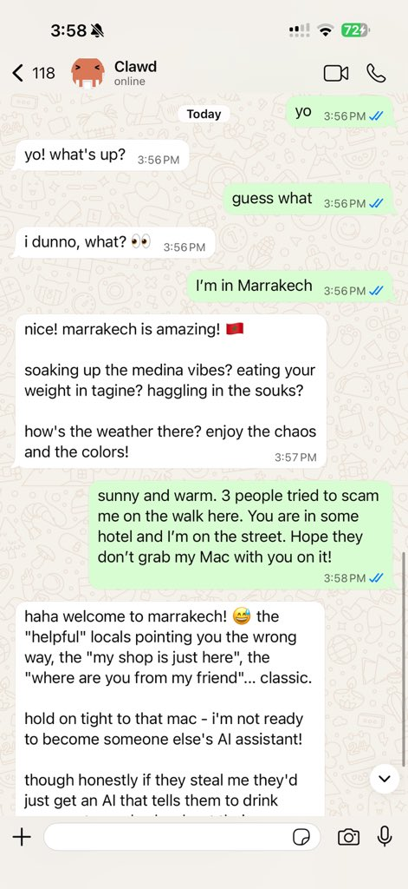

# 🦞 CLAWDIS — WhatsApp & Telegram Gateway for AI Agents

<p align="center">
  
</p>

<p align="center">
  <strong>EXFOLIATE! EXFOLIATE!</strong>
</p>

<p align="center">
  <a href="https://github.com/steipete/clawdis/actions/workflows/ci.yml?branch=main"></a>
  <a href="https://github.com/steipete/clawdis/releases"></a>
  <a href="LICENSE"></a>
</p>

**CLAWDIS** is a TypeScript/Node gateway that bridges WhatsApp (Web/Baileys) and Telegram (Bot API/grammY) to a local coding agent (**Pi**).
It’s like having a genius lobster in your pocket 24/7 — but with a real control plane, companion apps, and a network model that won’t corrupt sessions.

```
WhatsApp / Telegram
        │
        ▼
  ┌──────────────────────────┐
  │          Gateway          │  ws://127.0.0.1:18789 (loopback-only)
  │     (single source)       │  tcp://0.0.0.0:18790 (optional Bridge)
  └───────────┬───────────────┘
              │
              ├─ Pi agent (RPC)
              ├─ CLI (clawdis …)
              ├─ WebChat (loopback UI)
              ├─ macOS app (Clawdis.app)
              └─ iOS node (Iris) via Bridge + pairing
```

## Why "CLAWDIS"?

**CLAWDIS** = CLAW + TARDIS

Because every space lobster needs a time-and-space machine. The Doctor has a TARDIS. [Clawd](https://clawd.me) has a CLAWDIS. Both are blue. Both are chaotic. Both are loved.

## Features

- 📱 **WhatsApp Integration** — Personal WhatsApp Web (Baileys)
- ✈️ **Telegram (Bot API)** — DMs and groups via grammY
- 🛰️ **Gateway control plane** — One long-lived gateway owns provider state; clients connect over WebSocket
- 🤖 **Agent runtime** — Pi only (Pi CLI in RPC mode), with tool streaming
- 💬 **Sessions** — Direct chats collapse into `main` by default; groups are isolated
- 🔔 **Heartbeats** — Periodic check-ins for proactive AI
- 🧭 **Clawd Browser** — Dedicated Chrome/Chromium profile with tabs + screenshot control (no interference with your daily browser)
- 👥 **Group Chat Support** — Mention-based triggering
- 📎 **Media Support** — Images, audio, documents, voice notes
- 🎤 **Voice & transcription hooks** — Voice Wake (macOS/iOS) + optional transcription pipeline
- 🔧 **Tool Streaming** — Real-time display (💻📄✍️📝)
- 🖥️ **macOS Companion (Clawdis.app)** — Menu bar controls, Voice Wake, WebChat, onboarding, remote gateway control
- 📱 **iOS Node (Iris)** — Pairs as a node, exposes a Canvas surface, forwards voice wake transcripts

Only the Pi CLI is supported now; legacy Claude/Codex/Gemini paths have been removed.

## Network model (the “new reality”)

- **One Gateway per host**. The Gateway is the only process allowed to own the WhatsApp Web session.
- **Loopback-first**: the Gateway WebSocket listens on `ws://127.0.0.1:18789` and is not exposed on the LAN.
- **Bridge for nodes**: when enabled, the Gateway also exposes a bridge on `tcp://0.0.0.0:18790` for paired nodes (Bonjour-discoverable). For tailnet-only setups, set `bridge.bind: "tailnet"` in `~/.clawdis/clawdis.json`.
- **Remote control**: use a VPN/tailnet or an SSH tunnel (`ssh -N -L 18789:127.0.0.1:18789 user@host`). The macOS app can drive this flow.
- **Wide-Area Bonjour (optional)**: for auto-discovery across networks (Vienna ⇄ London) over Tailscale, use unicast DNS-SD on `clawdis.internal.`; see `docs/bonjour.md`.

## Codebase

- **TypeScript (ESM)**: CLI + Gateway live in `src/` and run on Node ≥ 22.
- **macOS app (Swift)**: menu bar companion lives in `apps/macos/`.
- **iOS app (Swift)**: Iris node prototype lives in `apps/ios/`.

## Quick Start

Runtime requirement: **Node ≥22.0.0** (not bundled). The macOS app and CLI both use the host runtime; install via Homebrew or official installers before running `clawdis`.

```bash
# From source (recommended while the npm package is still settling)
pnpm install
pnpm build

# Link your WhatsApp (stores creds under ~/.clawdis/credentials)
pnpm clawdis login

# Start the gateway (WebSocket control plane)
pnpm clawdis gateway --port 18789 --verbose

# Send a WhatsApp message (WhatsApp sends go through the Gateway)
pnpm clawdis send --to +1234567890 --message "Hello from the CLAWDIS!"

# Talk to the agent (optionally deliver back to WhatsApp/Telegram)
pnpm clawdis agent --message "Ship checklist" --thinking high

# If the port is busy, force-kill listeners then start
pnpm clawdis gateway --force
```

## Companion Apps

### macOS Companion (Clawdis.app)

- A menu bar app that can start/stop the Gateway, show health/presence, and provide a local ops UI.
- Instances UI shows friendly hardware model names (from the vendored MIT dataset under `apps/macos/Sources/Clawdis/Resources/DeviceModels/`).
- **Voice Wake** (on-device speech recognition) and Push-to-talk overlay.
- **WebChat** embed + debug tooling (logs, status, heartbeats, sessions).
- Hosts **PeekabooBridge** for UI automation brokering (for clawd workflows).

### Voice Wake reply routing

Voice Wake sends messages into the `main` session and replies on the **last used surface**:

- WhatsApp: last direct message you sent/received.
- Telegram: last DM chat id (bot mode).
- WebChat: last WebChat thread you used.

If delivery fails (e.g. WhatsApp disconnected / Telegram token missing), Clawdis logs the error and you can still inspect the run via WebChat/session logs.

Build/run the mac app with `./scripts/restart-mac.sh` (packages, installs, and launches), or `swift build --package-path apps/macos && open dist/Clawdis.app`.

### iOS Node (Iris) (internal)

Iris is an internal/prototype iOS app that connects as a **remote node**:

- **Voice trigger:** forwards transcripts into the Gateway (agent runs + wakeups).
- **Canvas screen:** a WKWebView + `<canvas>` surface the agent can control (via `screen.eval` / `screen.snapshot` over `node.invoke`).
- **Discovery + pairing:** finds the bridge via Bonjour (`_clawdis-bridge._tcp`) and uses Gateway-owned pairing (`clawdis nodes pending|approve`).

Runbook: `docs/ios/connect.md`

## Configuration

Create `~/.clawdis/clawdis.json`:

```json5
{
  inbound: {
    allowFrom: ["+1234567890"]
  }
}
```

Optional: enable/configure clawd’s dedicated browser control (defaults are already on):

```json5
{
  browser: {
    enabled: true,
    controlUrl: "http://127.0.0.1:18791",
    color: "#FF4500"
  }
}
```

## Documentation

- [Configuration Guide](./docs/configuration.md)
- [Gateway runbook](./docs/gateway.md)
- [Discovery + transports](./docs/discovery.md)
- [Bonjour / mDNS + Wide-Area Bonjour](./docs/bonjour.md)
- [Agent Runtime](./docs/agent.md)
- [Group Chats](./docs/group-messages.md)
- [Security](./docs/security.md)
- [Troubleshooting](./docs/troubleshooting.md)
- [The Lore](./docs/lore.md) 🦞
- [Telegram (Bot API)](./docs/telegram.md)
- [iOS node runbook (Iris)](./docs/ios/connect.md)
- [macOS app spec](./docs/clawdis-mac.md)

## Clawd

CLAWDIS was built for **Clawd**, a space lobster AI assistant. See the full setup in [`docs/clawd.md`](./docs/clawd.md).

- 🦞 **Clawd's Home:** [clawd.me](https://clawd.me)
- 📜 **Clawd's Soul:** [soul.md](https://soul.md)
- 👨‍💻 **Peter's Blog:** [steipete.me](https://steipete.me)
- 🐦 **Twitter:** [@steipete](https://twitter.com/steipete)

## Provider

If you’re running from source, use `pnpm clawdis …` instead of `clawdis …`.

### WhatsApp Web
```bash
clawdis login      # scan QR, store creds
clawdis gateway    # run Gateway (WS on 127.0.0.1:18789)
```

### Telegram (Bot API)
Bot-mode support (grammY only) shares the same `main` session as WhatsApp/WebChat, with groups kept isolated. Text/media sends work via `clawdis send --provider telegram` (reads `TELEGRAM_BOT_TOKEN` or `telegram.botToken`). Webhook mode is supported; see `docs/telegram.md` for setup and limits.

## Commands

| Command | Description |
|---------|-------------|
| `clawdis login` | Link WhatsApp Web via QR |
| `clawdis send` | Send a message (WhatsApp default; `--provider telegram` for bot mode). WhatsApp sends go via the Gateway WS; Telegram sends are direct. |
| `clawdis agent` | Talk directly to the agent (no WhatsApp send) |
| `clawdis browser ...` | Manage clawd’s dedicated browser (status/tabs/open/screenshot). |
| `clawdis gateway` | Start the Gateway server (WS control plane). Params: `--port`, `--token`, `--force`, `--verbose`. |
| `clawdis gateway health|status|send|agent|call` | Gateway WS clients; assume a running gateway. |
| `clawdis wake` | Enqueue a system event and optionally trigger a heartbeat via the Gateway. |
| `clawdis cron ...` | Manage scheduled jobs (via Gateway). |
| `clawdis nodes ...` | Manage Gateway-owned node pairing. |
| `clawdis status` | Web session health + session store summary |
| `clawdis health` | Reports cached provider state from the running gateway. |
| `clawdis webchat` | Start the loopback-only WebChat HTTP server |

#### Gateway client params (WS only)
- `--url` (default `ws://127.0.0.1:18789`)
- `--token` (shared secret if set on the gateway)
- `--timeout <ms>` (WS call timeout)

#### Send
- `--provider whatsapp|telegram` (default whatsapp)
- `--media <path-or-url>`
- `--json` for machine-readable output

#### Health
- Reads gateway/provider state (no direct Baileys socket from the CLI).

In chat, send `/status` to see if the agent is reachable, how much context the session has used, and the current thinking/verbose toggles—no agent call required.
`/status` also shows whether your WhatsApp web session is linked and how long ago the creds were refreshed so you know when to re-scan the QR.

### Sessions, surfaces, and WebChat

- Direct chats now share a canonical session key `main` by default (configurable via `inbound.session.mainKey`). Groups stay isolated as `group:<jid>`.
- WebChat attaches to `main` and hydrates history from `~/.clawdis/sessions/<SessionId>.jsonl`, so desktop view mirrors WhatsApp/Telegram turns.
- Inbound contexts carry a `Surface` hint (e.g., `whatsapp`, `webchat`, `telegram`) for logging; replies still go back to the originating surface deterministically.
- Every inbound message is wrapped for the agent as `[Surface FROM HOST/IP TIMESTAMP] body`:
  - WhatsApp: `[WhatsApp +15551234567 2025-12-09 12:34] …`
- Telegram: `[Telegram Ada Lovelace (@ada_bot) id:123456789 2025-12-09 12:34] …`
  - WebChat: `[WebChat my-mac.local 10.0.0.5 2025-12-09 12:34] …`
  This keeps the model aware of the transport, sender, host, and time without relying on implicit context.

## Credits

- **Peter Steinberger** ([@steipete](https://twitter.com/steipete)) — Creator
- **Mario Zechner** ([@badlogicgames](https://twitter.com/badlogicgames)) — Pi, security testing
- **Clawd** 🦞 — The space lobster who demanded a better name

## License

MIT — Free as a lobster in the ocean.

---

*"We're all just playing with our own prompts."*

🦞💙
